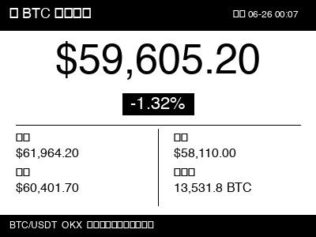

# zectrix-btc-ticker

将 BTC 实时价格推送到 [Zectrix 极趣](https://cloud.zectrix.com) 墨水屏设备的看板脚本。

数据来源：OKX 公开行情 API（无需账号）。每分钟自动刷新，推送 400×300 黑白图片到指定页面。



## 功能

- BTC/USDT 实时价格（大字显示）
- 24h 涨跌幅
- 24h 最高 / 最低 / 开盘价 / 成交量
- 更新时间戳
- 本地预览模式（不推送，仅生成图片）

## 快速开始

**1. 克隆并安装依赖**

```bash
git clone https://github.com/alexzhang2015/zectrix-btc-ticker.git
cd zectrix-btc-ticker
python3 -m venv .venv
source .venv/bin/activate   # Windows: .venv\Scripts\activate
pip install -r requirements.txt
```

**2. 配置**

```bash
cp config.example.json config.json
```

编辑 `config.json`：

```json
{
  "api_key": "zt_your_api_key_here",
  "device_id": "AA:BB:CC:DD:EE:FF",
  "page_id": 3,
  "interval_seconds": 60
}
```

| 字段 | 说明 |
|------|------|
| `api_key` | Zectrix 后台 → 开放API 获取，格式 `zt_xxx` |
| `device_id` | 设备 MAC 地址，后台 → 设备管理可查 |
| `page_id` | 推送到哪个页面（1-5） |
| `interval_seconds` | 刷新间隔（秒），建议 ≥ 60 |

**3. 本地预览**

```bash
python btc_ticker.py --preview
# 生成 btc_preview.png，确认布局后再推送
```

**4. 启动**

```bash
python btc_ticker.py
```

后台持续运行：

```bash
nohup python btc_ticker.py > btc.log 2>&1 &
```

## 关于刷新间隔

Zectrix 设备有独立的同步间隔设置（默认 10 分钟）。若要接近 1 分钟刷新效果，需在后台 → 设备设置 → 同步间隔改为 **1 分钟**。

## 环境要求

- Python 3.8+
- `requests`、`Pillow`

## 相关资源

- [Zectrix 极趣科技 Wiki](https://wiki.zectrix.com)
- [Open API 文档](https://cloud.zectrix.com/home/api-docs)
- [社区开源插件列表](https://wiki.zectrix.com/zh/software/Community-OpenSource)
